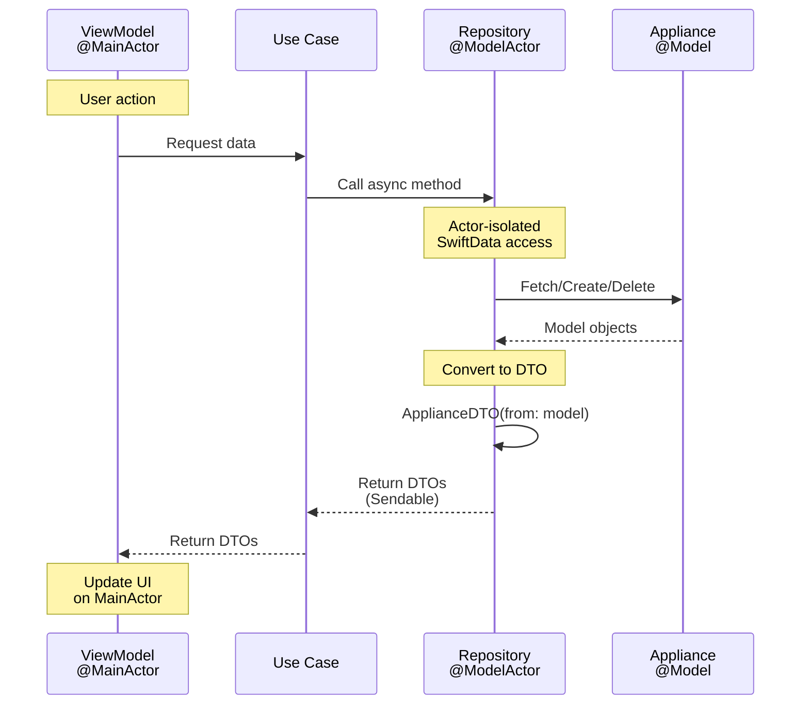

# Architecture Overview

## Clean Architecture Layers

```mermaid
flowchart TB
    subgraph App["🔵 App Layer"]
        DI[AppDependencyContainer<br/>Composition Root]
    end

    subgraph Presentation["🟠 Presentation Layer<br/>@MainActor"]
        Views[SwiftUI Views]
        VMs[ViewModels<br/>@Observable]
    end

    subgraph Domain["🟣 Domain Layer<br/>Business Logic"]
        UseCases[Use Cases<br/>Protocol-based]
        DTOs[ApplianceDTO<br/>ApplianceCreationData<br/><i>Sendable</i>]
    end

    subgraph Data["🟢 Data Layer<br/>@ModelActor"]
        Repos[Repositories<br/>SwiftData • CoreML • Static]
        Models[Appliance<br/>@Model<br/><i>NOT Sendable</i>]
    end

    DI --> Views
    DI --> VMs
    DI --> UseCases
    DI --> Repos

    Views --> VMs
    VMs --> UseCases
    UseCases --> Repos
    Repos -.->|converts to| DTOs
    DTOs -.->|crosses boundaries| VMs

    style App fill:#e1f5ff,stroke:#0288d1,stroke-width:3px
    style Presentation fill:#fff4e6,stroke:#f57c00,stroke-width:3px
    style Domain fill:#f3e5f5,stroke:#7b1fa2,stroke-width:3px
    style Data fill:#e8f5e9,stroke:#388e3c,stroke-width:3px
```

## SwiftData Concurrency Pattern



**Key Patterns:**
- ✅ `@ModelActor` for safe SwiftData access
- ✅ `ApplianceDTO` (Sendable) crosses actor boundaries
- ✅ `PersistentIdentifier` for model references
- ✅ No `@unchecked Sendable` needed

## Layer Responsibilities

### 🔵 App Layer
- Dependency injection (AppDependencyContainer)
- Wires ModelContainer → Repositories → Use Cases → ViewModels

### 🟠 Presentation Layer
- SwiftUI Views + ViewModels (@Observable)
- All UI logic runs on @MainActor
- Works with DTOs (Sendable data)

### 🟣 Domain Layer
- Use Cases (business logic)
- DTOs for crossing actor boundaries
- Protocol-based for testability

### 🟢 Data Layer
- Repositories with @ModelActor
- SwiftData models (NOT Sendable)
- Converts models → DTOs before returning

## Key Architecture Principles

**1. Dependency Inversion**
```
Presentation → Domain ← Data
```
Outer layers depend on inner abstractions (protocols)

**2. Actor Isolation**
```
@MainActor (UI) ←→ DTOs (Sendable) ←→ @ModelActor (Data)
```
Never pass `@Model` objects across actor boundaries

**3. Protocol-Based Design**
```
ViewModel → UseCaseProtocol ← UseCase → RepositoryProtocol ← Repository
```
Enables testing and flexibility
